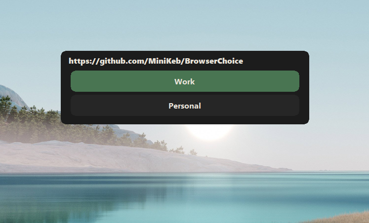

# Browser Choice



## Why
I'm a massive browser tabs user and I did this application to separate my "personnal" tabs from my "work" tabs.
The concept is quiet simple : Proposing to choose which web browser should be open when I click on a link.

## How
The application wait an url as parameter : 
```
BrowserChoice.exe https://github.com/
```

You can define as many web browser that you want in the configuration file : 
```
<webBrowsers>
  <webBrowser title="Work" path="C:\Program Files (x86)\Google\Chrome\Application\chrome.exe" />
  <webBrowser title="Personal" path="C:\Program Files (x86)\Firefox Developer Edition\firefox.exe" />
  <webBrowser title="Other" path="C:\Program Files\Internet Explorer\iexplore.exe" />
</webBrowsers>
```

To register the application in the base registry, you just have to call : 
```
BrowserChoice.exe --register
```
So the application will be available in the web browser list of default application.

The UAC can be little bit boring, so you can disable it by following the steps below : 
1. Click Start and in the instance search type "Local Security Policy" and 
        as it appears in the search result, press Enter to run it, note: UAC will prompt.
        So pass the UAC prompt correctly.  
        (Note: You can also press `Win + R` and when the Run dialog appears type: `secpol.msc` and press Enter). 
2. Now expand the Local Policies tree, and click on the Security Options. 
3. On the right-side a list of security settings will appear, search for "User Account Control: Behavior of the elevation prompt for administrators in Admin Approval Mode". 
4. Right-click on it and choose Properties a dialog will appear. 
5. In the middle of the dialog, you'll see a comboBox with the default value = "Prompt for consent for non-Windows binaries". 
6. Click on that comboBox and choose "Elevate without prompting", click Apply and OK. 
